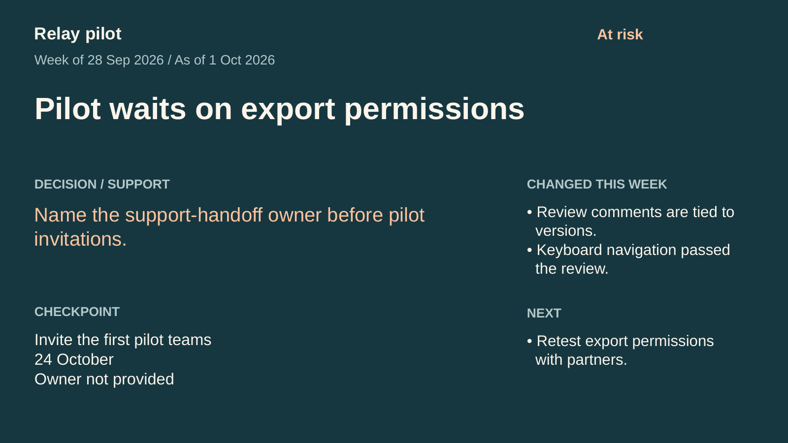

# One Slide Update

**Your weekly notes. One editable slide. Three original layouts.**

Turn supplied project notes into a PowerPoint slide you can drop into an existing
update deck. Pick a progress-first, decision-first, or milestone-first layout.
The text stays editable; missing facts stay missing.



## Try it without an AI agent

Python 3.10+ is the only runtime requirement. No packages to install, API keys,
account, network calls, or global changes.

From this repository:

```sh
python skills/one-slide-update/scripts/fill_update.py fill \
  examples/inputs/relay-update.json my-update.pptx --layout blocker

python skills/one-slide-update/scripts/fill_update.py check \
  my-update.pptx --layout blocker
```

Open `my-update.pptx` in your presentation editor. To reuse the original layouts
manually, open the three editable files in
[`skills/one-slide-update/assets/`](skills/one-slide-update/assets/).
The helper intentionally refuses to overwrite an existing file.

## The same notes, three ways

| Layout | When it helps | Editable example | Preview |
|---|---|---|---|
| Standard | Progress leads, checkpoint alongside | [PPTX](examples/outputs/relay-standard.pptx) | [PNG](examples/previews/relay-standard.png) |
| Blocker | A decision or support request needs attention | [PPTX](examples/outputs/relay-blocker.pptx) | [PNG](examples/previews/relay-blocker.png) |
| Milestone | A supplied checkpoint date is the focus | [PPTX](examples/outputs/relay-milestone.pptx) | [PNG](examples/previews/relay-milestone.png) |

The examples come from [original fictional weekly notes](examples/inputs/relay-weekly-notes.md).
They show a delayed pilot, an unknown owner, and no fabricated KPI. Compare the
[missing-data example](examples/previews/missing-data.png): no inferred green
status, current date, owner, or completion percentage.

## Use with a skill-capable agent

Copy the complete `skills/one-slide-update` folder into the target project's
skill directory. This is a project-local install; choose one for your agent.

```sh
# Codex, from the target project (adjust the source path)
mkdir -p .agents/skills
cp -R /path/to/one-slide-update/skills/one-slide-update .agents/skills/

# Claude Code, from the target project
mkdir -p .claude/skills
cp -R /path/to/one-slide-update/skills/one-slide-update .claude/skills/
```

Do not copy over an existing same-name skill without reviewing it first.

Example request:

> Use one-slide-update to turn these weekly notes into one editable PowerPoint
> slide. Use the blocker layout. Preserve unknowns and don't invent metrics.

The discovery locations above follow the official [Codex skill documentation](https://learn.chatgpt.com/docs/build-skills)
and [Claude Code skill documentation](https://code.claude.com/docs/en/skills).
This package follows the [Agent Skills format](https://agentskills.io/specification).
Actual automatic loading has not been exercised in those products in this
release. Other agents may read the instruction file, but cross-agent discovery
and file-generation support vary. Claude web/Cowork and Google Slides workflows
are not claimed as tested.

## Make your own input

Start from [`assets/update-input.json`](skills/one-slide-update/assets/update-input.json).

- `project`, `period`, `as_of`, `status`, `headline`: supplied text
- `progress`, `next`: arrays of short supplied statements
- `decision`: the actual decision/support request, if known
- `milestone`: `label` and `date`, both supplied
- `owner`: the owner supplied by the notes
- `source_notes`: provenance pointers, placed in editable speaker notes
- `layout`: optional `standard`, `blocker`, or `milestone`

Missing/null fields display as “not provided” or “Not assessed.” This does not
mean nothing happened or no risk exists. The helper never guesses dates or
calculates progress. It does not verify whether supplied claims are true.

## What is checked

- Exactly one fixed 16:9 slide
- Every supported text shape stays within slide bounds
- Named text slots retain their designed positions and sizes
- Text boxes do not overlap
- Font family, size and weight stay unchanged
- Explicit line wraps fit conservative width/line-count budgets
- Long text fails with the field name instead of shrinking or truncating

The helper fills **these bundled templates**, not arbitrary customer PPTX
files. It doesn't send, publish, upload, or update a live deck. There is no
telemetry. Input/output stay on the machine where you run it.

## Limits and visual review

The v0 assets have English section labels. Fit metrics cover Latin-script text
and common punctuation. Unsupported characters produce an explicit error;
there is no silent translation or replacement glyph. The [original Chinese-input
fixture](examples/inputs/chinese-update.json) was tested and exits with an explicit
unsupported-character error before writing a PPTX. No CJK slide was rendered, so
CJK font fallback and rendered line fit are unverified. Preserve a user's language
and required template, even if that means adapting a layout outside this helper.

Templates use Liberation Sans, a metrically compatible alternative to Arial.
The font is not bundled or installed. Open the output and check it before
sharing, especially if your editor substitutes fonts. Width budgets include a
margin and line breaks are explicit, but they cannot guarantee identical
rendering in every application.

The supplied templates and examples were rendered with LibreOffice and reviewed
as PNGs. Text remains native PPTX text; slides contain no flattened screenshots.
PowerPoint, Keynote and Google Slides application behavior has not been tested.
No automatic fact checking, chart generation, visual fit certification, or
measured productivity gain is claimed.

## Development checks

```sh
python -m unittest discover -s tests -v
```

The tests use temporary directories. Optional preview generation needs your
own presentation renderer; LibreOffice and Poppler were used for the included
PNGs. They are not needed to fill a slide.

## Why this exists

Project reporting often ends in a slide even when its source is elsewhere.
Public users described [manual custom visual reporting](https://forum.asana.com/t/custom-reporting/1128372)
and [copying status data into a broader deck because screenshots were hard to read](https://forum.asana.com/t/introducing-portfolio-powerpoint-export/997686).
These reports motivated the small kit. They do not establish demand for this
repository or imply that the products' current limitations are unchanged.

The practical contribution here is three original editable assets and a small,
inspectable local fill/check workflow. General presentation and PM skills already
exist. This is not a new slide engine or a claim of better reasoning.

## Provenance

This original kit was developed with AI assistance. Code, fictional examples,
layouts and documentation were inspected and tested as described in
[`tests/VERIFICATION.md`](tests/VERIFICATION.md). AI assistance and a passing test
suite do not establish factual accuracy or compatibility with every slide editor.

## License

Original layouts, examples, instructions and code: [MIT](LICENSE).
The measured font-advance data retains its [SIL Open Font License notice](skills/one-slide-update/assets/FONT_LICENSE.txt).
No font binary, stock slide template, proprietary/internal skill, or third-party
logo is included.
